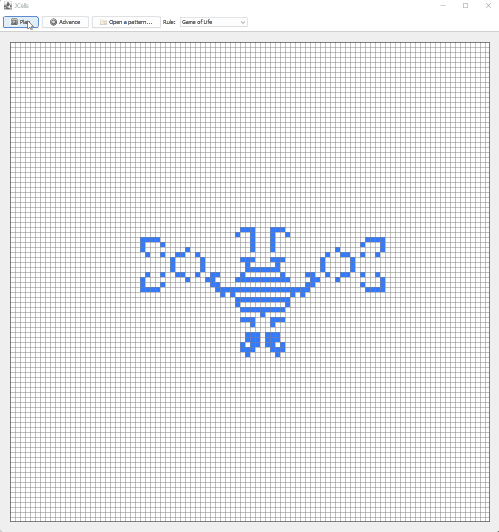

# JCells
A system for evaluating [Life-like cellular automata](https://conwaylife.com/wiki/Life-like_cellular_automaton)

`./gradlew run`

## Features
- Parses [RLE](https://conwaylife.com/wiki/Run_Length_Encoded) (extended run-length encoded) pattern files
- Realtime rule switching, reset, pause

## TODO
1. ~~Parse [RLE](https://conwaylife.com/wiki/Run_Length_Encoded) format~~
    + https://catagolue.hatsya.com/software
2. ~~Fix the [Generations](https://conwaylife.com/wiki/Generations) rule~~
3. ~~Make the UI look nice~~
   + ~~main panel is "floating" and has a nice shadow, right hand-side has the buttons~~
4. Allow non-Life rules like [Turmite](https://en.wikipedia.org/wiki/Turmite) that look at groups of cells at a time
    + As an idea, maybe pass in a living cell and its neighboring cells and determine their state at the same time?
5. ~~Dropdown menu to switch between multiple preset rules~~
6. ~~Reset button~~
7. Parse mc (macrocell) files
